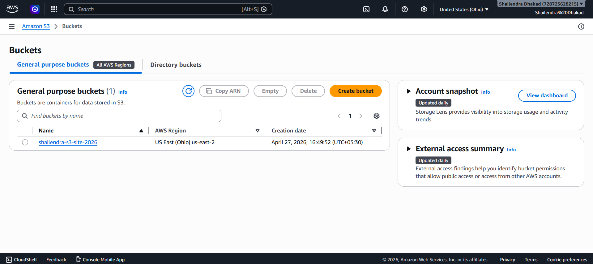
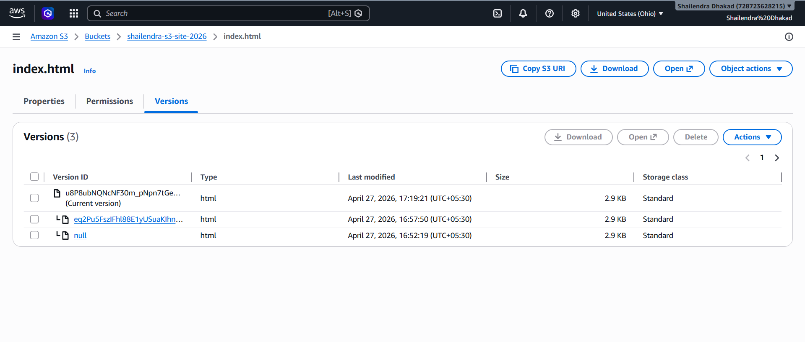
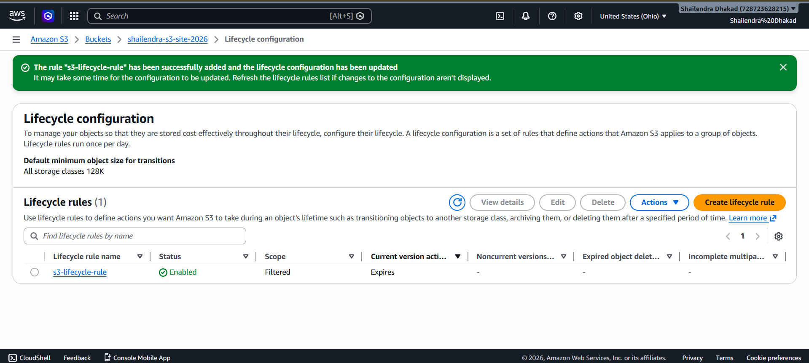
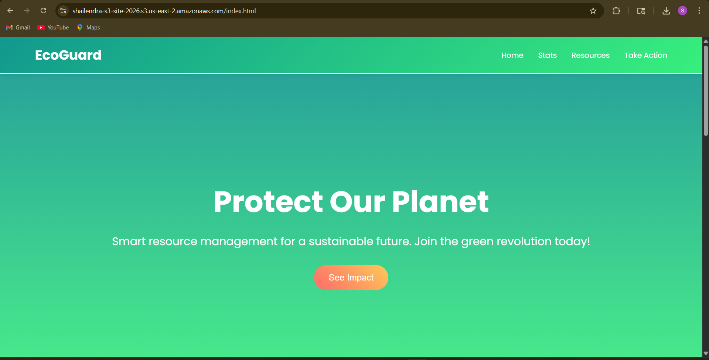
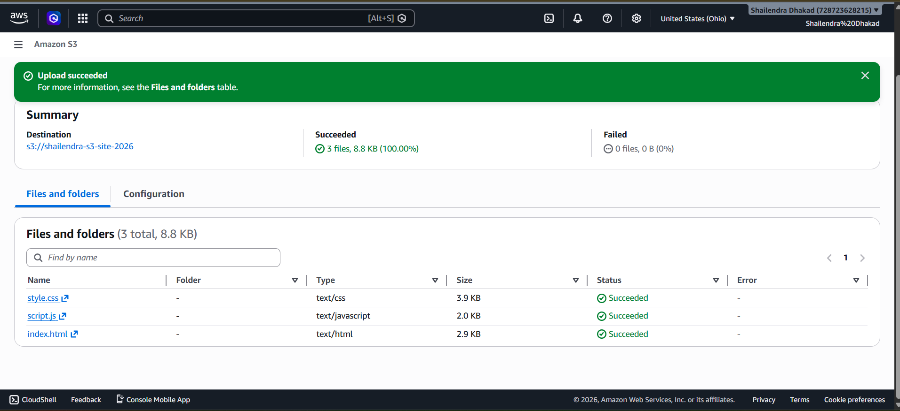

# AWS S3 Static Website Hosting Assignment

## 👤 Name
Shailendra Dhakad

## 🎓 Registration Number
12318248

---

## 🌐 Live Website
https://shailendra-s3-site-2026.s3.us-east-2.amazonaws.com/index.html

---

## 📌 Project Description
This project demonstrates hosting a static website using Amazon S3. It includes static website hosting, versioning of objects, and lifecycle rules for cost optimization.

---

## ⚙️ Features Implemented
- Static website hosting using AWS S3
- Public access configuration using bucket policy
- Versioning enabled (multiple versions of index.html)
- Lifecycle rules for storage optimization and deletion of old versions

---

## 📸 Screenshots

### 1. S3 Bucket (Files Uploaded)
Shows uploaded files in S3 bucket.

---

### 2. Versioning Enabled
Shows multiple versions of `index.html`.

---

### 3. Lifecycle Rule Configuration
Shows lifecycle rule:
- Delete noncurrent versions after 7 days

---

### 4. Website Running (Live S3 Site)

---
### 4. Website Running (Live S3 Site)

---

## 🧠 Key Learnings
- AWS S3 static website hosting
- Object versioning and rollback concept
- Lifecycle policies for cost optimization
- Bucket policy and public access configuration

---

## ⚠️ Challenges Faced
- Configuring S3 bucket public access correctly
- Understanding versioning behavior
- Setting lifecycle rules properly

---

## ✅ Status
Project completed successfully using AWS S3 services.
